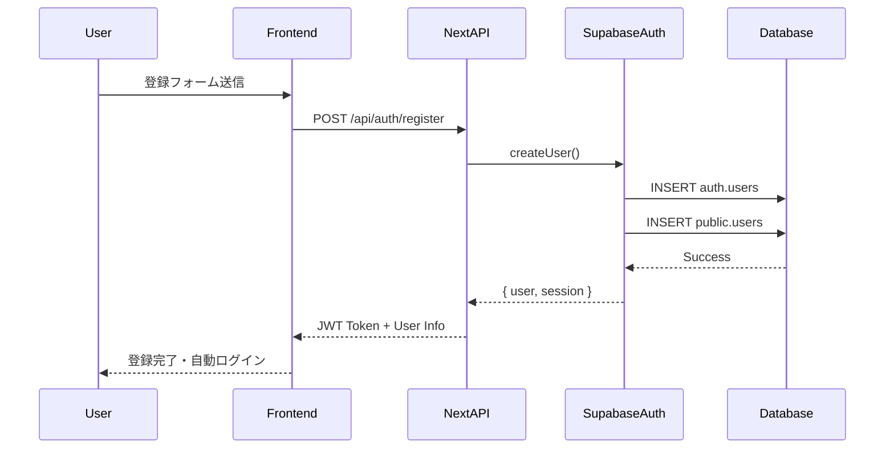
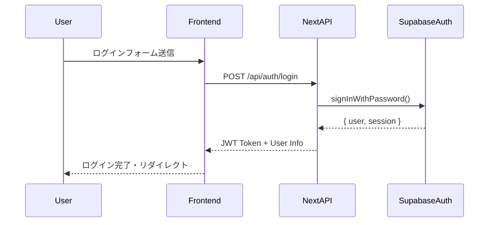
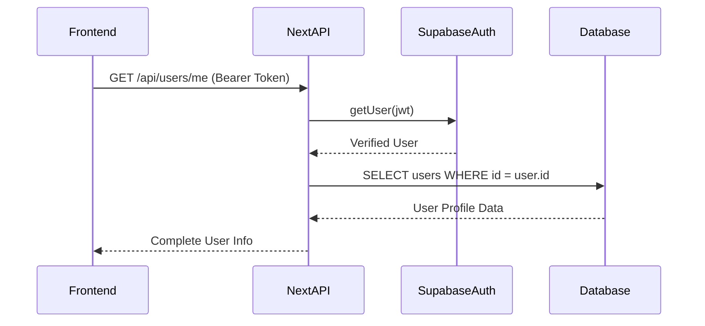

# 認証・認可システム - tsumiageプロジェクト

## 🔐 認証システム概要

### 採用技術
- **Supabase Auth**: 認証基盤
- **JWT Token**: セッション管理
- **Row Level Security (RLS)**: データアクセス制御
- **Next.js Middleware**: ルート保護

### 認証フロー概要
```
User → Frontend → Supabase Auth → JWT Token → API → RLS → Database
```

### 技術スタック（2025年対応）
- **Next.js 15** (App Router)
- **@supabase/ssr** (推奨パッケージ、auth-helpersは非推奨)
- **TypeScript** (厳密な型安全性)

**重要な変更点:**
- ❌ `@supabase/auth-helpers` は非推奨
- ✅ `@supabase/ssr` を使用（Server-Side Auth対応）
- ✅ `supabase.auth.getUser()` 推奨（サーバーサイド）

---

## 🔄 認証フロー詳細

### 1. ユーザー登録フロー


### 2. ログインフロー


### 3. 認証状態確認フロー


---

## 🛡️ JWT Token 管理

### Token 構造
```json
{
  "aud": "authenticated",
  "exp": 1642752000,
  "sub": "user-uuid-here",
  "email": "user@example.com",
  "role": "authenticated"
}
```

### Token 有効期限
- **Access Token**: 1時間
- **Refresh Token**: 30日
- **自動更新**: Frontend で自動リフレッシュ

---

## 🔒 Row Level Security (RLS) ポリシー

### 基本方針
1. **デフォルト拒否**: すべてのテーブルでRLS有効
2. **最小権限**: 必要最小限のアクセスのみ許可
3. **ユーザー分離**: 自分のデータのみアクセス可能
4. **公開データ**: 投稿・プロフィールは全体公開

### 主要ポリシー例
```sql
-- ユーザーテーブル
CREATE POLICY "All users can view all profiles" ON users
  FOR SELECT USING (true);

CREATE POLICY "Users can update own profile" ON users
  FOR UPDATE USING (auth.uid() = id);

-- 投稿テーブル
CREATE POLICY "All users can view all posts" ON posts
  FOR SELECT USING (true);

CREATE POLICY "Users can manage own posts" ON posts
  FOR ALL USING (auth.uid() = user_id);
```

---

## 🔐 Next.js Middleware ルート保護

### Middleware 設定
```typescript
// middleware.ts
import { createServerClient } from '@supabase/ssr'
import { NextResponse } from 'next/server'

export async function middleware(request: NextRequest) {
  let response = NextResponse.next()

  const supabase = createServerClient(
    process.env.NEXT_PUBLIC_SUPABASE_URL!,
    process.env.NEXT_PUBLIC_SUPABASE_ANON_KEY!,
    {
      cookies: {
        get(name: string) {
          return request.cookies.get(name)?.value
        },
        set(name: string, value: string, options: CookieOptions) {
          response.cookies.set({ name, value, ...options })
        }
      },
    }
  )

  const { data: { user } } = await supabase.auth.getUser()

  // 未認証ユーザーが保護ルートにアクセス
  if (request.nextUrl.pathname.startsWith('/dashboard') && !user) {
    return NextResponse.redirect(new URL('/login', request.url))
  }

  return response
}
```

---

## 🛡️ セキュリティ対策

### 1. パスワードポリシー
- 最小8文字以上
- 複雑性要件は簡素化（アクセシビリティ重視）

### 2. セッション管理
- 自動ログアウト（30日間無操作）
- セッション延長・定期チェック

### 3. CSRF・XSS対策
- JWT Token による状態管理でCSRF攻撃を防止
- Next.js の自動エスケープ機能活用
- DOMPurify によるサニタイゼーション

---

## 🚨 エラーハンドリング

### 認証エラー一覧
```typescript
enum AuthError {
  // 401 Unauthorized
  INVALID_CREDENTIALS = 'メールアドレスまたはパスワードが間違っています',
  TOKEN_EXPIRED = 'セッションが期限切れです。再度ログインしてください',
  INVALID_TOKEN = '無効な認証情報です',
  
  // 403 Forbidden  
  INSUFFICIENT_PERMISSIONS = 'この操作を実行する権限がありません',
  ACCOUNT_DISABLED = 'アカウントが無効化されています',
  
  // 422 Business Error
  EMAIL_ALREADY_EXISTS = 'このメールアドレスは既に登録されています',
  WEAK_PASSWORD = 'パスワードは8文字以上で設定してください'
}
```

---

## 📊 認証監視・ログ

### 認証イベント記録
- ログイン・ログアウト・登録・認証失敗
- IPアドレス・User Agent記録
- セキュリティアラート（ブルートフォース攻撃検出）

### セキュリティ監視
- 不正アクセス検出
- ログイン失敗回数制限（5回でブロック）
- 異常なアクセスパターンの監視

---

## 🔧 開発・テスト用認証

### テスト用ユーザー
```typescript
const testUsers = [
  {
    email: 'test1@example.com',
    password: 'password123',
    nickname: 'テストユーザー1',
    goal_months: 6,
    habit_name: '腕立て伏せ30回'
  }
];
```

### 開発環境設定
- 認証バイパス機能（`NODE_ENV=development`時のみ）
- テストアカウント自動生成

---

## tsumiage固有要件

### 拡張ユーザー情報
- ニックネーム（必須）
- 恋愛目標期間（○ヶ月以内に彼女作る・登録時必須）
- 習慣化項目（毎日継続する項目・登録時必須）
- 初期データ: experience: 0, level: 1, relationship_status: 'single'

### データベース設計
```sql
CREATE TABLE users (
  id UUID PRIMARY KEY REFERENCES auth.users(id) ON DELETE CASCADE,
  nickname VARCHAR NOT NULL,
  resolution TEXT NOT NULL,
  goal_months INTEGER NOT NULL,
  habit_name VARCHAR NOT NULL,
  experience INTEGER DEFAULT 0,
  level INTEGER DEFAULT 1,
  relationship_status VARCHAR DEFAULT 'single',
  created_at TIMESTAMP DEFAULT NOW()
);
```

この認証・認可設計により、セキュアで使いやすい認証システムが構築できます！