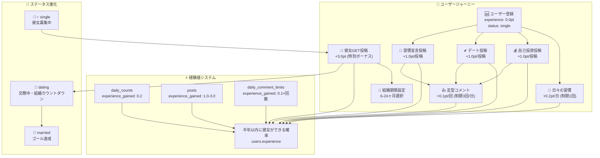
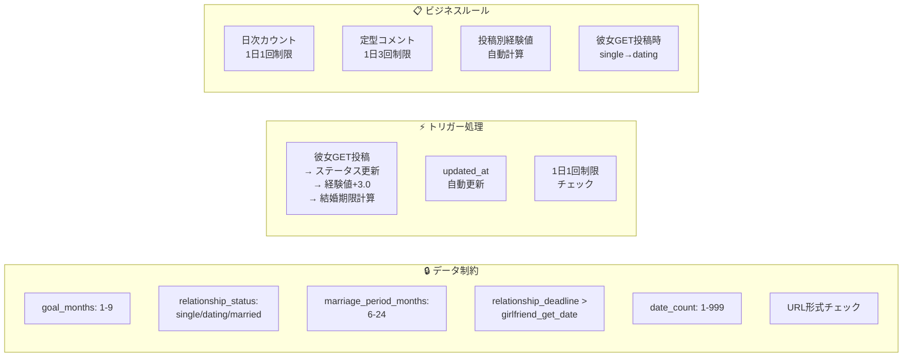
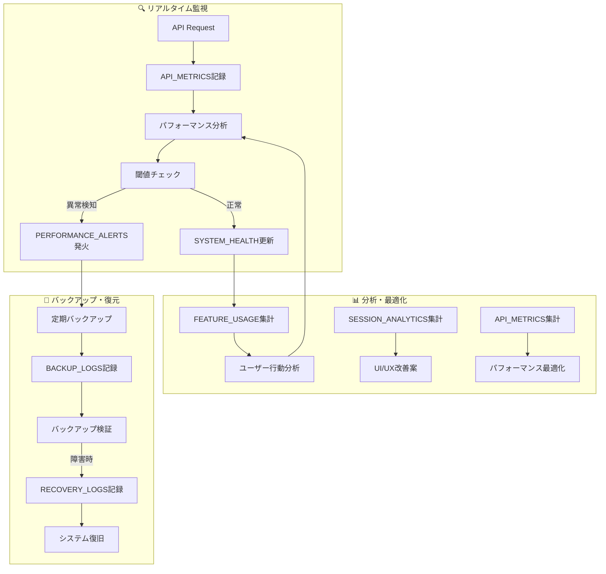

# tsumiage データベースER図・リレーション図

## 🗄️ Entity Relationship Diagram (ERD)

### Mermaid ER図 - 全体構造

```mermaid
erDiagram
    %% ==========================================================
    %% Core User Management
    %% ==========================================================
    USERS {
        uuid id PK "主キー (Supabase Auth連携)"
        varchar nickname "ニックネーム (50文字)"
        int goal_months "目標月数 (1-9ヶ月)"
        varchar habit_name "習慣名 (100文字)"
        decimal experience "経験値 (半年以内に彼女ができる確率)"
        varchar relationship_status "恋愛ステータス (single/dating/married)"
        date girlfriend_get_date "彼女GET日"
        date relationship_deadline "結婚目標日"
        int marriage_period_months "結婚期間 (6-24ヶ月)"
        timestamp created_at
        timestamp updated_at
    }
    
    DAILY_COUNTS {
        uuid user_id PK,FK "ユーザーID"
        date count_date PK "カウント日"
        boolean completed "実行完了フラグ"
        decimal experience_gained "獲得経験値 (+0.2pt)"
        timestamp created_at
    }
    
    %% ==========================================================
    %% Post System Foundation
    %% ==========================================================
    POST_TYPES {
        int id PK "投稿タイプID"
        varchar name "内部名 (self_investment/date/habit_declaration/girlfriend_get)"
        varchar display_name "表示名"
        decimal base_experience "基本経験値"
    }
    
    POSTS {
        uuid id PK "投稿ID"
        uuid user_id FK "投稿者ID"
        int post_type_id FK "投稿タイプ"
        date post_date "投稿日"
        decimal experience_gained "獲得経験値"
        timestamp created_at
        timestamp updated_at
    }
    
    %% ==========================================================
    %% Post Details (4 Types)
    %% ==========================================================
    SELF_INVESTMENT_POSTS {
        uuid id PK
        uuid post_id FK "投稿ID"
        varchar product_name "商品名 (200文字)"
        text product_url "商品URL"
        int amount "金額"
        text comment "コメント (500文字)"
    }
    
    DATE_POSTS {
        uuid id PK
        uuid post_id FK "投稿ID"
        varchar meeting_source "出会いのルーツ (100文字)"
        int meeting_count "会った回数 (1-999)"
        text goal_and_result "目標と結果 (500文字)"
        text next_goal "次回目標 (300文字)"
        text location_url "場所URL"
    }
    
    HABIT_DECLARATION_POSTS {
        uuid id PK
        uuid post_id FK "投稿ID"
        text reference_url "参考URL"
        text action_content "行動内容 (300文字)"
        varchar frequency "頻度 (50文字)"
        text before_state "変化前 (200文字)"
        text after_state "変化後 (200文字)"
    }
    
    GIRLFRIEND_GET_POSTS {
        uuid id PK
        uuid post_id FK "投稿ID"
        int date_count "デート回数 (1-999)"
        text date_location_url "デート場所URL"
        text goal_and_result "目標と結果 (300文字)"
        text joy_comment "喜びの一言 (100文字)"
        timestamp created_at
    }
    
    %% ==========================================================
    %% Reaction System
    %% ==========================================================
    PRESET_COMMENT_TYPES {
        int id PK
        varchar name "定型コメント名 (50文字)"
        varchar display_name "表示名 (100文字)"
        decimal experience_points "経験値 (+0.1pt)"
        int sort_order "並び順"
        timestamp created_at
    }
    
    PRESET_COMMENTS {
        uuid id PK
        uuid user_id FK "定型コメントユーザー"
        uuid post_id FK "対象投稿"
        int preset_comment_type_id FK "定型コメントタイプ"
        timestamp created_at
    }
    
    DAILY_COMMENT_LIMITS {
        uuid user_id PK,FK "ユーザーID"
        date comment_date PK "定型コメント日"
        int comment_count "定型コメント回数"
        decimal experience_gained "獲得経験値"
        timestamp created_at
    }
    
    %% ==========================================================
    %% Error Monitoring & Logging
    %% ==========================================================
    ERROR_LOGS {
        uuid id PK
        varchar error_level "エラーレベル (INFO/WARN/ERROR/CRITICAL)"
        varchar error_type "エラータイプ"
        varchar error_code "エラーコード"
        text error_message "エラーメッセージ"
        varchar layer "発生層 (API/CONTROLLER/TASK/RESOURCE)"
        varchar component_name "コンポーネント名"
        varchar method_name "メソッド名"
        uuid user_id FK "ユーザーID"
        varchar session_id "セッションID"
        varchar request_id "リクエストID"
        jsonb error_details "エラー詳細"
        jsonb request_data "リクエストデータ"
        timestamp created_at
    }
    
    GIRLFRIEND_GET_ERROR_LOGS {
        uuid id PK
        uuid user_id FK "ユーザーID"
        varchar error_stage "エラー段階"
        jsonb error_details "エラー詳細"
        jsonb attempted_post_data "試行データ"
        varchar user_status_before "変更前ステータス"
        varchar user_status_after "変更後ステータス"
        boolean rollback_successful "ロールバック成功"
        timestamp created_at
    }
    
    %% ==========================================================
    %% Relationships
    %% ==========================================================
    USERS ||--o{ DAILY_COUNTS : "1日1回制限"
    USERS ||--o{ POSTS : "投稿"
    USERS ||--o{ PRESET_COMMENTS : "定型コメント"
    USERS ||--o{ DAILY_COMMENT_LIMITS : "1日3回制限"
    USERS ||--o{ ERROR_LOGS : "エラー記録"
    USERS ||--|| GIRLFRIEND_GET_ERROR_LOGS : "特別監視"
    
    POST_TYPES ||--o{ POSTS : "投稿分類"
    
    POSTS ||--o| SELF_INVESTMENT_POSTS : "自己投資詳細"
    POSTS ||--o| DATE_POSTS : "デート詳細"
    POSTS ||--o| HABIT_DECLARATION_POSTS : "習慣宣言詳細"
    POSTS ||--o| GIRLFRIEND_GET_POSTS : "彼女GET詳細 ⭐特別⭐"
    POSTS ||--o{ PRESET_COMMENTS : "投稿定型コメント"
    
    PRESET_COMMENT_TYPES ||--o{ PRESET_COMMENTS : "定型コメント分類"
```


### 視覚的データフロー図


### データベース制約・トリガー図


## 🔗 リレーションシップ詳細

### 主要なリレーション
```
users (1) ──────── (N) daily_counts
  │                     │
  │                     └─ 1日1回制限 (PK: user_id, count_date)
  │
users (1) ──────── (N) posts  
  │                     │
  │                     ├─ (1) ──── (1) self_investment_posts
  │                     ├─ (1) ──── (1) date_posts  
  │                     ├─ (1) ──── (1) habit_declaration_posts
  │                     └─ (1) ──── (1) girlfriend_get_posts ⭐特別⭐
  │
users (1) ──────── (N) preset_comments
  │                     │
  │                     └─ UNIQUE制約 (user_id, post_id, preset_comment_type_id)
  │
users (1) ──────── (N) daily_comment_limits
  │                     │
  │                     └─ 1日3回制限 (PK: user_id, comment_date)
  │
users (1) ──────── (N) error_logs (監視用)
  │
  └─────────────── (N) girlfriend_get_error_logs (特別監視)


posts (1) ──────── (N) preset_comments

post_types (1) ─── (N) posts

preset_comment_types (1) ─ (N) preset_comments
```

## 📊 データ制約・ビジネスルール

### 重要な制約
```sql
-- ユーザー制約
ALTER TABLE users ADD CONSTRAINT check_goal_months 
  CHECK (goal_months BETWEEN 1 AND 9);
  
ALTER TABLE users ADD CONSTRAINT check_relationship_status
  CHECK (relationship_status IN ('single', 'dating', 'married'));
  
ALTER TABLE users ADD CONSTRAINT check_marriage_period
  CHECK (marriage_period_months BETWEEN 6 AND 24);
  
ALTER TABLE users ADD CONSTRAINT check_relationship_deadline
  CHECK (relationship_deadline > girlfriend_get_date);

-- 彼女GET投稿制約
ALTER TABLE girlfriend_get_posts ADD CONSTRAINT check_date_count
  CHECK (date_count BETWEEN 1 AND 999);
  
ALTER TABLE girlfriend_get_posts ADD CONSTRAINT check_goal_length  
  CHECK (length(goal_and_result) BETWEEN 1 AND 300);
  
ALTER TABLE girlfriend_get_posts ADD CONSTRAINT check_joy_length
  CHECK (length(joy_comment) BETWEEN 1 AND 100);

-- URL形式制約
ALTER TABLE self_investment_posts ADD CONSTRAINT check_url_format
  CHECK (product_url ~ '^https?://.*');
  
ALTER TABLE date_posts ADD CONSTRAINT check_location_url
  CHECK (location_url ~ '^https?://.*');

-- 1日1回制限（複合主キー）
ALTER TABLE daily_counts ADD PRIMARY KEY (user_id, count_date);

-- 定型コメント重複防止
ALTER TABLE preset_comments ADD UNIQUE (user_id, post_id, preset_comment_type_id);

-- 1日定型コメント制限
ALTER TABLE daily_comment_limits ADD PRIMARY KEY (user_id, comment_date);
```

## 🔄 トリガー・自動処理

### 重要なトリガー処理
```sql
-- 1. 彼女GET投稿時の自動処理
CREATE TRIGGER process_girlfriend_get_post_trigger 
  AFTER INSERT ON girlfriend_get_posts 
  FOR EACH ROW 
  EXECUTE FUNCTION process_girlfriend_get_post();
  
-- 処理内容：
-- ✅ relationship_status: 'single' → 'dating'
-- ✅ relationship_deadline: girlfriend_get_date + marriage_period_months
-- ✅ experience: +3.0pt (投稿+1.0pt + 特別ボーナス+2.0pt)

-- 2. updated_at自動更新
CREATE TRIGGER update_users_updated_at 
  BEFORE UPDATE ON users 
  FOR EACH ROW 
  EXECUTE FUNCTION update_updated_at_column();

-- 3. 1日1回制限チェック
CREATE TRIGGER check_daily_count_limit_trigger 
  BEFORE INSERT ON daily_counts 
  FOR EACH ROW 
  EXECUTE FUNCTION check_daily_count_limit();
```

## 📈 インデックス戦略

### パフォーマンス最適化インデックス
```sql
-- ユーザー関連
CREATE INDEX idx_users_relationship_status ON users(relationship_status);
CREATE INDEX idx_users_created_at ON users(created_at);

-- 投稿関連 (頻繁なクエリ対象)
CREATE INDEX idx_posts_user_created_at ON posts(user_id, created_at DESC);
CREATE INDEX idx_posts_type_created_at ON posts(post_type_id, created_at DESC);
CREATE INDEX idx_posts_date_created_at ON posts(post_date, created_at DESC);

-- 日次カウント (ダッシュボード表示用)
CREATE INDEX idx_daily_counts_user_date ON daily_counts(user_id, count_date DESC);
CREATE INDEX idx_daily_counts_completed_date ON daily_counts(completed, count_date DESC);

-- 定型コメント (タイムライン表示用)
CREATE INDEX idx_preset_comments_post_created_at ON preset_comments(post_id, created_at DESC);
CREATE INDEX idx_preset_comments_user_created_at ON preset_comments(user_id, created_at DESC);

-- 監視・分析用
CREATE INDEX idx_error_logs_level_created_at ON error_logs(error_level, created_at DESC);
CREATE INDEX idx_api_metrics_endpoint_timestamp ON api_metrics(endpoint, request_timestamp DESC);
```

## 🎯 経験値システムデータフロー

### 経験値計算ロジック
```
Daily Count Completed ────→ experience +0.2pt (1日1回制限)
      │
      └─ daily_counts.experience_gained = +0.2pt

Self Investment Post ─────→ experience +1.0pt
Date Post ───────────────→ experience +1.0pt  
Habit Declaration Post ──→ experience +1.0pt
      │
      └─ posts.experience_gained = +1.0pt

Girlfriend GET Post ─────→ experience +3.0pt (特別ボーナス)
      │                     │
      │                     ├─ 投稿基本: +1.0pt
      │                     └─ 特別ボーナス: +2.0pt  
      │
      └─ posts.experience_gained = +3.0pt

Preset Comment Given ───────→ experience +0.1pt (1日3回制限)
      │
      └─ daily_comment_limits.experience_gained += +0.1pt
```

## 🔒 セキュリティ・RLS設定

### Row Level Security ポリシー
```sql
-- ユーザーデータ保護
CREATE POLICY "All users can view profiles" ON users
  FOR SELECT USING (true);
  
CREATE POLICY "Users can only update own profile" ON users
  FOR UPDATE USING (auth.uid() = id);

-- 投稿データアクセス制御
CREATE POLICY "All users can view posts" ON posts
  FOR SELECT USING (true);
  
CREATE POLICY "Users can only manage own posts" ON posts
  FOR ALL USING (auth.uid() = user_id);

-- 定型コメントアクセス制御
CREATE POLICY "Users can only manage own preset comments" ON preset_comments
  FOR ALL USING (auth.uid() = user_id);

-- エラーログ（管理者のみ）
CREATE POLICY "Only system can access error logs" ON error_logs
  FOR ALL USING (false) WITH CHECK (true);
```

## 📊 データ容量・成長予測

### 想定データサイズ
| テーブル | 初期 | 1年後 | 備考 |
|---------|------|-------|------|
| users | 1,000 | 10,000 | ユーザー成長 |
| posts | 10,000 | 500,000 | 投稿頻度: 1ユーザー/週2投稿 |
| daily_counts | 30,000 | 3,650,000 | 日次記録 |
| preset_comments | 50,000 | 2,000,000 | 定型コメント活性度 |
| error_logs | 1,000 | 100,000 | 運用安定化で減少 |

### ストレージ最適化
- **パーティショニング**: date系テーブル（月別分割）
- **アーカイブ**: 古いerror_logs（90日後削除）
- **インデックス最適化**: 使用頻度別調整

## 📡 API監視・パフォーマンステーブル

### API監視システム

```mermaid
erDiagram
    %% ==========================================================
    %% API Performance & Monitoring
    %% ==========================================================
    API_METRICS {
        uuid id PK
        varchar endpoint "APIエンドポイント (/api/auth/login)"
        varchar method "HTTPメソッド (GET/POST/PUT/DELETE)"
        int status_code "レスポンスステータス"
        int response_time_ms "レスポンス時間(ms)"
        int request_size_bytes "リクエストサイズ"
        int response_size_bytes "レスポンスサイズ"
        uuid user_id FK "リクエストユーザー"
        varchar user_agent "ユーザーエージェント"
        varchar ip_address "送信元IP"
        varchar session_id "セッションID"
        varchar request_id "リクエスト追跡ID"
        jsonb request_headers "リクエストヘッダー"
        jsonb response_headers "レスポンスヘッダー"
        timestamp request_timestamp "リクエスト時刻"
        timestamp response_timestamp "レスポンス時刻"
    }
    
    API_RATE_LIMITS {
        uuid id PK
        varchar endpoint "APIエンドポイント"
        varchar rate_limit_key "制限キー (user_id/ip_address)"
        varchar rate_limit_type "制限タイプ (per_user/per_ip/global)"
        int limit_count "制限回数"
        int current_count "現在カウント"
        timestamp window_start "制限期間開始"
        timestamp window_end "制限期間終了"
        boolean is_blocked "ブロック状態"
        timestamp created_at
        timestamp updated_at
    }
    
    PERFORMANCE_ALERTS {
        uuid id PK
        varchar alert_type "アラートタイプ (slow_response/high_error_rate/rate_limit_exceeded)"
        varchar endpoint "対象エンドポイント"
        varchar severity "重要度 (INFO/WARN/ERROR/CRITICAL)"
        int threshold_value "閾値"
        int current_value "現在値"
        text alert_message "アラートメッセージ"
        jsonb alert_details "詳細情報"
        boolean is_resolved "解決済み"
        timestamp triggered_at "発火時刻"
        timestamp resolved_at "解決時刻"
    }
    
    SYSTEM_HEALTH {
        uuid id PK
        varchar component "コンポーネント (database/auth/storage/api)"
        varchar status "ステータス (healthy/degraded/down)"
        decimal cpu_usage "CPU使用率"
        decimal memory_usage "メモリ使用率"
        decimal disk_usage "ディスク使用率"
        int active_connections "アクティブ接続数"
        int queue_size "処理待ちキュー"
        decimal response_time_avg "平均レスポンス時間"
        timestamp checked_at "チェック時刻"
    }
    
    %% ==========================================================
    %% Feature Usage Analytics
    %% ==========================================================
    FEATURE_USAGE {
        uuid id PK
        uuid user_id FK "ユーザーID"
        varchar feature_name "機能名 (girlfriend_get_post/daily_count/reaction)"
        varchar action "アクション (view/create/update/delete)"
        varchar source "アクセス元 (web/mobile/api)"
        jsonb feature_details "機能固有データ"
        varchar session_id "セッションID"
        timestamp used_at "使用時刻"
    }
    
    SESSION_ANALYTICS {
        uuid id PK
        uuid user_id FK "ユーザーID"
        varchar session_id "セッションID"
        timestamp session_start "セッション開始"
        timestamp session_end "セッション終了"
        int duration_seconds "セッション継続時間"
        int page_views "ページビュー数"
        int actions_count "アクション回数"
        varchar last_page "最終ページ"
        varchar referrer "参照元"
        varchar device_type "デバイスタイプ"
        varchar browser "ブラウザ"
        varchar os "OS"
    }
    
    %% ==========================================================
    %% Data Backup & Recovery
    %% ==========================================================
    BACKUP_LOGS {
        uuid id PK
        varchar backup_type "バックアップタイプ (full/incremental/differential)"
        varchar target "対象 (database/files/full_system)"
        varchar status "ステータス (running/completed/failed)"
        varchar backup_location "バックアップ先"
        bigint backup_size_bytes "バックアップサイズ"
        int duration_seconds "実行時間"
        text error_message "エラーメッセージ"
        timestamp started_at "開始時刻"
        timestamp completed_at "完了時刻"
    }
    
    RECOVERY_LOGS {
        uuid id PK
        uuid backup_log_id FK "復元元バックアップ"
        varchar recovery_type "復元タイプ (full/partial/point_in_time)"
        varchar target "復元対象"
        varchar status "ステータス (running/completed/failed)"
        timestamp target_timestamp "復元時点"
        int duration_seconds "復元時間"
        text error_message "エラーメッセージ"
        uuid performed_by FK "実行者"
        timestamp started_at "開始時刻"
        timestamp completed_at "完了時刻"
    }
    
    %% Relationships
    USERS ||--o{ API_METRICS : "APIアクセス記録"
    USERS ||--o{ FEATURE_USAGE : "機能使用記録"
    USERS ||--o{ SESSION_ANALYTICS : "セッション記録"
    USERS ||--o{ RECOVERY_LOGS : "復元実行記録"
    
    BACKUP_LOGS ||--o{ RECOVERY_LOGS : "バックアップ→復元"
```


### システム監視フロー図


## 🎛️ 運用監視ダッシュボード設計

### 主要ビュー定義
```sql
-- ==========================================================
-- パフォーマンス監視ビュー
-- ==========================================================

-- API パフォーマンス サマリー (5分間隔)
CREATE VIEW api_performance_summary AS
SELECT 
    date_trunc('minute', request_timestamp) as time_bucket,
    endpoint,
    COUNT(*) as request_count,
    AVG(response_time_ms) as avg_response_time,
    PERCENTILE_CONT(0.95) WITHIN GROUP (ORDER BY response_time_ms) as p95_response_time,
    COUNT(CASE WHEN status_code >= 400 THEN 1 END) as error_count,
    COUNT(CASE WHEN status_code >= 500 THEN 1 END) as server_error_count
FROM api_metrics 
WHERE request_timestamp >= NOW() - INTERVAL '1 hour'
GROUP BY time_bucket, endpoint
ORDER BY time_bucket DESC;

-- エラー率が高いエンドポイント
CREATE VIEW high_error_endpoints AS
SELECT 
    endpoint,
    COUNT(*) as total_requests,
    COUNT(CASE WHEN status_code >= 400 THEN 1 END) as error_count,
    (COUNT(CASE WHEN status_code >= 400 THEN 1 END) * 100.0 / COUNT(*)) as error_rate
FROM api_metrics 
WHERE request_timestamp >= NOW() - INTERVAL '24 hours'
GROUP BY endpoint
HAVING COUNT(*) > 100 AND (COUNT(CASE WHEN status_code >= 400 THEN 1 END) * 100.0 / COUNT(*)) > 5
ORDER BY error_rate DESC;

-- ==========================================================
-- ユーザー行動分析ビュー
-- ==========================================================

-- アクティブユーザー統計
CREATE VIEW user_activity_stats AS
SELECT 
    date_trunc('day', used_at) as activity_date,
    COUNT(DISTINCT user_id) as daily_active_users,
    COUNT(DISTINCT CASE WHEN feature_name = 'girlfriend_get_post' THEN user_id END) as girlfriend_get_users,
    COUNT(DISTINCT CASE WHEN feature_name = 'daily_count' THEN user_id END) as daily_habit_users,
    COUNT(*) as total_actions
FROM feature_usage 
WHERE used_at >= NOW() - INTERVAL '30 days'
GROUP BY activity_date
ORDER BY activity_date DESC;

-- 機能使用率ランキング
CREATE VIEW feature_popularity AS
SELECT 
    feature_name,
    action,
    COUNT(*) as usage_count,
    COUNT(DISTINCT user_id) as unique_users,
    AVG(CASE WHEN session_analytics.duration_seconds IS NOT NULL 
        THEN session_analytics.duration_seconds END) as avg_session_duration
FROM feature_usage
LEFT JOIN session_analytics ON feature_usage.session_id = session_analytics.session_id
WHERE feature_usage.used_at >= NOW() - INTERVAL '7 days'
GROUP BY feature_name, action
ORDER BY usage_count DESC;

-- ==========================================================
-- システム健全性ビュー
-- ==========================================================

-- 最新システム状態
CREATE VIEW current_system_status AS
SELECT 
    component,
    status,
    cpu_usage,
    memory_usage,
    disk_usage,
    active_connections,
    response_time_avg,
    checked_at,
    CASE 
        WHEN status = 'down' THEN 'CRITICAL'
        WHEN status = 'degraded' OR cpu_usage > 80 OR memory_usage > 85 THEN 'WARNING'
        ELSE 'OK'
    END as alert_level
FROM system_health 
WHERE checked_at = (SELECT MAX(checked_at) FROM system_health)
ORDER BY 
    CASE status 
        WHEN 'down' THEN 1 
        WHEN 'degraded' THEN 2 
        WHEN 'healthy' THEN 3 
    END;

-- アクティブアラート一覧
CREATE VIEW active_alerts AS
SELECT 
    alert_type,
    endpoint,
    severity,
    alert_message,
    triggered_at,
    EXTRACT(EPOCH FROM (NOW() - triggered_at))/60 as minutes_since_triggered
FROM performance_alerts 
WHERE is_resolved = false
ORDER BY 
    CASE severity 
        WHEN 'CRITICAL' THEN 1 
        WHEN 'ERROR' THEN 2 
        WHEN 'WARN' THEN 3 
        WHEN 'INFO' THEN 4 
    END,
    triggered_at ASC;

-- ==========================================================
-- バックアップ状況ビュー
-- ==========================================================

-- 最新バックアップ状況
CREATE VIEW backup_status AS
SELECT 
    backup_type,
    target,
    status,
    backup_size_bytes / (1024*1024*1024) as backup_size_gb,
    duration_seconds / 60 as duration_minutes,
    started_at,
    completed_at,
    CASE 
        WHEN status = 'failed' THEN 'ERROR'
        WHEN status = 'running' AND (NOW() - started_at) > INTERVAL '2 hours' THEN 'WARNING'
        WHEN status = 'completed' AND (NOW() - completed_at) > INTERVAL '25 hours' THEN 'WARNING'
        ELSE 'OK'
    END as status_level
FROM backup_logs 
WHERE started_at >= NOW() - INTERVAL '7 days'
ORDER BY started_at DESC;
```

## 📊 監視アラート設定

### 重要な監視指標・閾値
```sql
-- ==========================================================
-- パフォーマンスアラート設定
-- ==========================================================

-- 1. API レスポンス時間アラート
-- 閾値: 95パーセンタイル > 2000ms (2秒)
INSERT INTO performance_alerts (alert_type, severity, threshold_value)
VALUES ('slow_response', 'WARN', 2000);

-- 2. エラー率アラート  
-- 閾値: エラー率 > 5%
INSERT INTO performance_alerts (alert_type, severity, threshold_value)
VALUES ('high_error_rate', 'ERROR', 5);

-- 3. 彼女GET投稿エラー特別監視
-- 閾値: エラー率 > 1% (ビジネス重要機能)
INSERT INTO performance_alerts (alert_type, endpoint, severity, threshold_value)
VALUES ('high_error_rate', '/api/girlfriend-get/create', 'CRITICAL', 1);

-- ==========================================================
-- システムリソースアラート
-- ==========================================================

-- CPU使用率: > 80%
-- メモリ使用率: > 85%  
-- ディスク使用率: > 90%
-- アクティブ接続数: > 1000
-- 平均レスポンス時間: > 1000ms
```

## 🔄 データライフサイクル管理

### データ保持・削除ポリシー
```sql
-- ==========================================================
-- データ保持期間設定
-- ==========================================================

-- API_METRICS: 90日保持 (パフォーマンス分析用)
CREATE EVENT delete_old_api_metrics
ON SCHEDULE EVERY 1 DAY
DO DELETE FROM api_metrics WHERE request_timestamp < NOW() - INTERVAL '90 days';

-- ERROR_LOGS: 180日保持 (トラブルシューティング用)
CREATE EVENT delete_old_error_logs  
ON SCHEDULE EVERY 1 DAY
DO DELETE FROM error_logs WHERE created_at < NOW() - INTERVAL '180 days';

-- FEATURE_USAGE: 1年保持 (ユーザー行動分析用)
CREATE EVENT delete_old_feature_usage
ON SCHEDULE EVERY 1 WEEK  
DO DELETE FROM feature_usage WHERE used_at < NOW() - INTERVAL '365 days';

-- SESSION_ANALYTICS: 6ヶ月保持 (ユーザー体験分析用)
CREATE EVENT delete_old_session_analytics
ON SCHEDULE EVERY 1 WEEK
DO DELETE FROM session_analytics WHERE session_start < NOW() - INTERVAL '180 days';

-- BACKUP_LOGS: 2年保持 (監査・復旧履歴用)
CREATE EVENT delete_old_backup_logs
ON SCHEDULE EVERY 1 MONTH
DO DELETE FROM backup_logs WHERE started_at < NOW() - INTERVAL '2 years';
```

## 💡 運用最適化レコメンド

### 自動チューニング提案
```sql
-- ==========================================================
-- パフォーマンス改善提案ビュー
-- ==========================================================

CREATE VIEW performance_recommendations AS
SELECT 
    'slow_endpoint' as recommendation_type,
    endpoint as target,
    AVG(response_time_ms) as avg_response_time,
    '1. インデックス追加検討\n2. クエリ最適化\n3. キャッシュ導入' as suggested_actions
FROM api_metrics 
WHERE request_timestamp >= NOW() - INTERVAL '24 hours'
GROUP BY endpoint
HAVING AVG(response_time_ms) > 1000

UNION ALL

SELECT 
    'high_traffic_endpoint' as recommendation_type,
    endpoint as target,
    COUNT(*) as request_count,
    '1. レート制限強化\n2. CDN導入検討\n3. 負荷分散設定' as suggested_actions
FROM api_metrics 
WHERE request_timestamp >= NOW() - INTERVAL '1 hour'
GROUP BY endpoint
HAVING COUNT(*) > 1000

UNION ALL

SELECT 
    'underused_feature' as recommendation_type,
    feature_name as target,
    COUNT(DISTINCT user_id) as unique_users,
    '1. UI改善検討\n2. チュートリアル追加\n3. プロモーション実施' as suggested_actions
FROM feature_usage 
WHERE used_at >= NOW() - INTERVAL '30 days'
GROUP BY feature_name
HAVING COUNT(DISTINCT user_id) < 100;
```

このER図により、データ構造とリレーションが明確になり、開発・運用時の理解が深まります。特に本格運用時の監視・分析・最適化の基盤として活用できます。