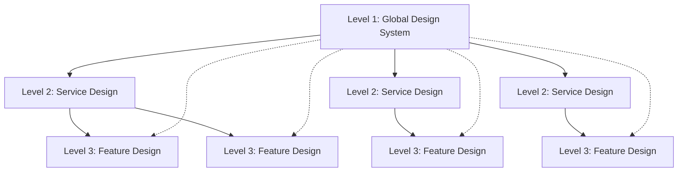
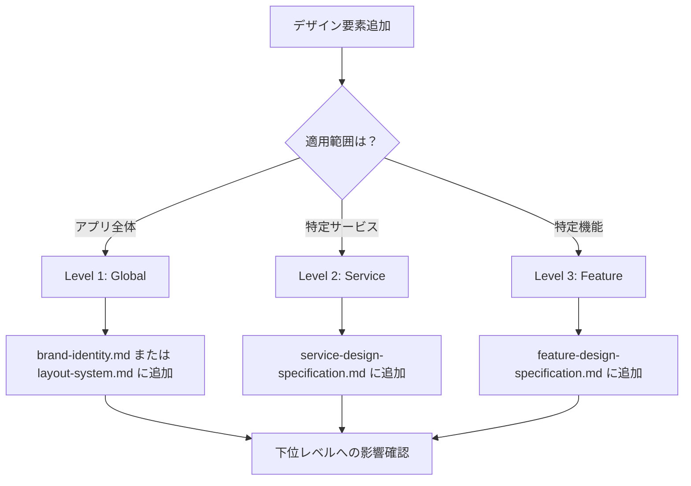
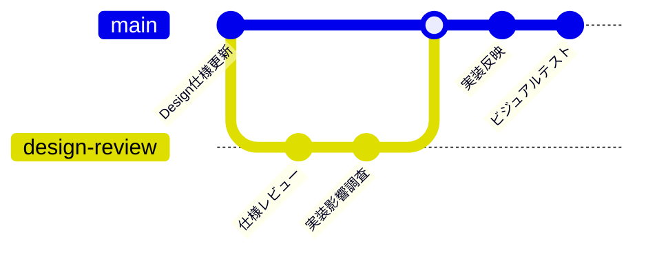

# projectname Design Architecture

## 📐 Design Specification Hierarchy

projectnameプロジェクトでは、**3層階層型デザイン仕様** を採用し、効率的なデザイン管理と実装の一貫性を確保します：

```
📁 docs/
├── 📁 guides/
│   └── 📄 brand-identity.md              ← ブランドアイデンティティ
├── 📁 architecture/
│   └── 📄 layout-system.md               ← レイアウトシステム
└── 📁 guides/
    └── 📄 design-architecture.md         ← このファイル（設計・管理）
├── 📁 男磨きSNSサービス/
│   ├── 📄 service-design-specification.md
│   └── 📁 [各機能]/
│       └── 📄 feature-design-specification.md
└── 📁 男磨き積み上げサービス/
    ├── 📄 service-design-specification.md
    └── 📁 [各機能]/
        └── 📄 feature-design-specification.md
```

---

## 🎨 Design Specification Levels

### Level 1: Global Design System
**ファイル**: `docs/design-system/brand-identity.md` + `docs/design-system/layout-system.md`

**責任範囲**: アプリケーション全体で共通利用される基盤デザイン要素

- **🌍 世界観・ブランドアイデンティティ**
- **🎨 カラーパレット・色彩体系**
- **📝 タイポグラフィ・フォントシステム**
- **📐 レイアウトグリッド・ブレークポイント**
- **🎭 アニメーション・トランジションルール**
- **♿ アクセシビリティ基準**
- **🧱 基本UI要素（ボタン、入力フィールド、アイコンなど）**

### Level 2: Service Design Specification
**ファイル**: `[サービス名]/service-design-specification.md`

**責任範囲**: 特定サービス内で共通利用される画面・セクション要素

- **🎯 サービス固有のカラーバリエーション**
- **🧭 ナビゲーション・ヘッダー仕様**
- **⚡ セクション切り替えアニメーション**
- **📱 レスポンシブ対応（サービス特有の調整）**
- **🎪 サービステーマ（ガジェット要素など）**

### Level 3: Feature Design Specification
**ファイル**: `[サービス名]/[機能名]/feature-design-specification.md`

**責任範囲**: 特定機能に特化したインタラクション・状態表現

- **🎪 モーダル・ダイアログ仕様**
- **📝 フォーム・入力コンポーネント**
- **⚠️ エラー状態・バリデーション表示**
- **⏳ ローディング・非同期処理表示**
- **🔄 機能固有のインタラクション**

---

## 🔄 Design Token Inheritance

### 継承関係


### Override Rules
1. **基本原則**: 上位レベルの仕様を継承
2. **カスタマイズ**: 下位レベルで必要な場合のみオーバーライド
3. **明示的参照**: オーバーライド時は参照元を明記

```markdown
例：サービス固有カラー定義
## 🎨 Color Variations
### Primary Colors（共通仕様継承）
- Base: `docs/design-system/brand-identity.md#primary-colors`を継承
- Custom: `--auth-primary: #00D9FF` （認証サービス固有）
```

---

## 📋 Template Structure

各レベルのデザイン仕様は以下の共通構造を持ちます：

### 必須セクション
```markdown
# [Level] Design Specification

## 🎨 Design Tokens
## 🧱 Components
## 📱 Responsive Rules
## ⚡ Animations
## 🔄 Inheritance References
## 🧪 Usage Examples
```

### 参照形式
```markdown
## 🔄 Design Token References
| 要素 | 継承元 | カスタマイズ |
|------|--------|-------------|
| Primary Color | `docs/design-system/brand-identity.md#colors` | - |
| Typography | `docs/design-system/brand-identity.md#typography` | 見出しサイズ調整 |
| Animation | `docs/design-system/brand-identity.md#animations` | フェード時間を0.3s→0.2s |
| Grid System | `docs/design-system/layout-system.md#grid` | コラム数調整 |
```

---

## 🎯 Implementation Guidelines

### For Developers
1. **実装開始前**: 該当する3レベルすべての仕様を確認
2. **デザイントークン**: CSS変数またはTailwind設定で共通定義
3. **コンポーネント設計**: 各レベルの責任に従ってコンポーネント分離

#### 実装順序
```typescript
// 1. Global Design Tokens（Level 1）
import { globalColors, globalTypography } from '@/styles/design-tokens/global'

// 2. Service Design Tokens（Level 2）
// 3. Feature Design Tokens（Level 3）
import { postFormStyles } from '@/styles/design-tokens/post-feature'
import { habitTrackingStyles } from '@/styles/design-tokens/habit-feature'
```

### For Designers
1. **仕様追加時**: 適切なレベルに配置（最小限のスコープ）
2. **変更時**: 影響範囲を明確化して関連レベルを更新
3. **レビュー**: 上位レベルとの整合性を確認

#### デザイン決定フロー


---

## 🚀 Quick Start

### 新しいコンポーネント作成時
1. **Level 1**: 基本的なデザイントークン確認
   - `docs/design-system/brand-identity.md#colors` でカラーパレット確認
   - `docs/design-system/layout-system.md#spacing` で余白システム確認
2. **Level 2**: サービス固有のバリエーション確認
   - 該当サービスの `service-design-specification.md` 確認
3. **Level 3**: 機能特有の要件定義
   - 該当機能の `feature-design-specification.md` 作成/確認
4. **実装**: 継承関係に従ってCSS/コンポーネント作成

### デザイン仕様更新時
1. **影響範囲調査**: どのレベルに属する変更か特定
2. **下位レベル確認**: 継承している仕様があるかチェック  
3. **一括更新**: 関連するすべてのレベルで整合性確保

#### 影響範囲チェックリスト
- [ ] Level 1 変更時：全サービス・全機能への影響確認
- [ ] Level 2 変更時：該当サービス内の全機能への影響確認
- [ ] Level 3 変更時：該当機能のみの影響確認
- [ ] デザイントークンの重複・競合チェック
- [ ] 実装コードとの同期確認

---

## 📚 Related Documents

### Design System Files
- **[Brand Identity](./brand-identity.md)** - ブランド・色・フォント仕様
- **[Layout System](./layout-system.md)** - グリッド・レイアウト仕様
  
- **[Social Service Design](../functional-requirements/男磨きSNSサービス/service-design-specification.md)** - SNSサービス固有仕様
- **[Records Service Design](../functional-requirements/男磨き積み上げサービス/service-design-specification.md)** - 積み上げサービス固有仕様

### Implementation Guidelines
- **[Frontend Implementation Guide](../guides/frontend-implementation-guide.md)** - フロントエンド実装指針
- **[Component Templates](../templates/specs/)** - コンポーネント仕様テンプレート

---

## 📝 Maintenance & Quality Assurance

### Version Control
- デザイン仕様の変更は必ずPRレビューを経る
- 破壊的変更は影響範囲を明示してアナウンス
- 各レベルでバージョン管理（Semantic Versioning準拠）

#### バージョニング例
```markdown
# Brand Identity v2.1.0

## 🔄 Changelog
### v2.1.0 (2024-01-15)
- MINOR: 新カラーパレット `--success-light` 追加
- PATCH: `--primary-dark` の彩度調整

### v2.0.0 (2024-01-01)  
- MAJOR: タイポグラフィシステム刷新（Breaking Change）
```

### Quality Assurance
- **デザイントークンの重複チェック**
  ```bash
  # CSS変数の重複確認
  grep -r "--primary-" src/styles/
  ```
- **継承関係の整合性チェック**
  - 参照リンクの有効性確認
  - Override時の参照元明記確認
- **実装とのギャップ確認**
  - Storybook で実装状況可視化
  - デザインレビュー時の仕様書照合

### Automation Tools
```json
{
  "scripts": {
    "design:validate": "node scripts/validate-design-tokens.js",
    "design:sync-check": "node scripts/check-design-implementation-sync.js",
    "design:generate-tokens": "node scripts/generate-css-tokens.js"
  }
}
```

---

## 🔧 Tools & Workflow

### Design Token Management
1. **Figma Tokens**: Figma プラグインでトークン管理
2. **Style Dictionary**: CSS/JS へのトークン変換
3. **Chromatic**: ビジュアルテスト・レグレッション検出

### Documentation Workflow


---

> **💡 Key Principle**: 
> デザインシステムは「制約」ではなく「効率化ツール」です。
> 適切な階層化により、一貫性を保ちながら柔軟性も確保します。

> **🎯 Architecture Goal**:
> 設計・実装・メンテナンスの各フェーズで開発者が迷わない、
> 明確で実用的なデザインアーキテクチャを提供します。